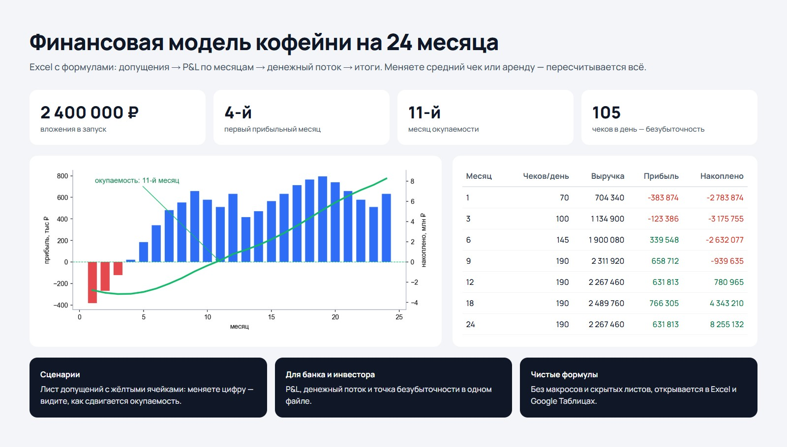
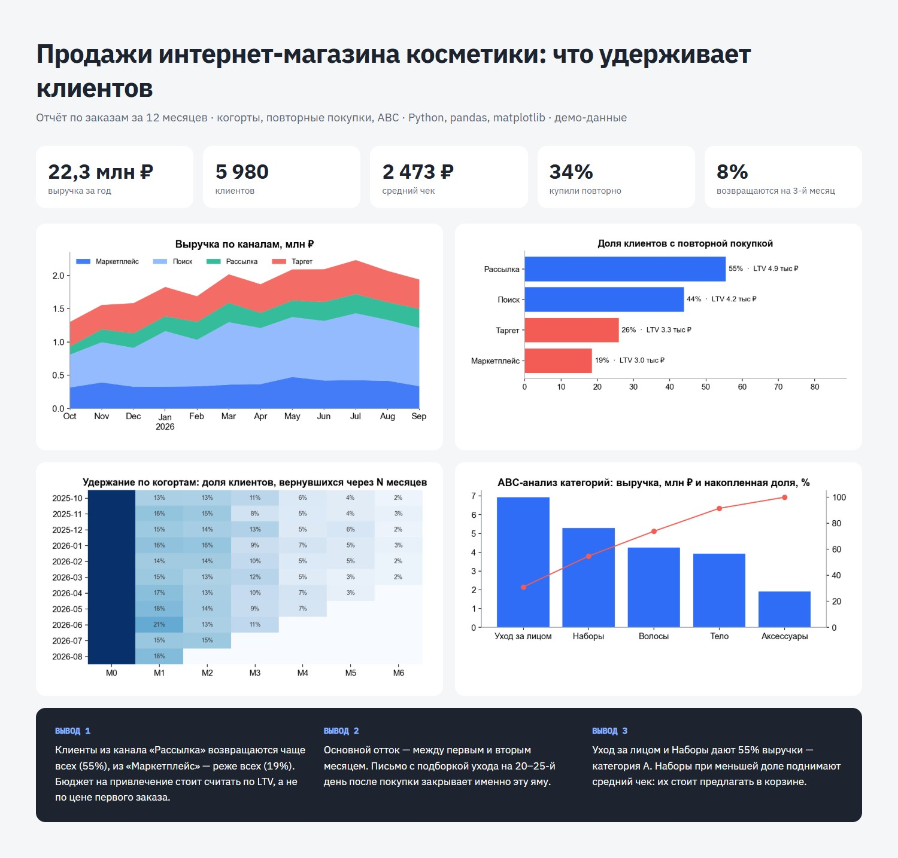

# data-analytics

Финансовое моделирование и аналитика продаж на Python. На выходе то, что на самом деле
просит основатель или банк: рабочая модель в Excel и понятный отчёт.

## financial-model

Модель кофейни на 24 месяца, собранная через openpyxl. Все числа живые формулы Excel,
поэтому клиент меняет допущения и сразу видит результат.

- лист допущений: средний чек, трафик, сезонность, себестоимость, аренда, фонд оплаты труда, капвложения
- помесячные P&L и движение денег, месяц безубыточности и срок окупаемости
- встроенные графики Excel и сводка в PNG для презентации инвестору



## sales-analytics

Отчёт по продажам на pandas и matplotlib: выручка по каналам и когортам, ABC-анализ
товаров, удержание и список рекомендуемых действий.



## Дашборд

Интерактивный дашборд продаж как витрина для этих цифр.


```bash
pip install -r requirements.txt
python financial-model/build.py
python sales-analytics/report.py
```
